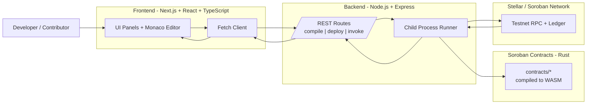

# Soroban Playground

Soroban Playground is a browser-based IDE for writing, compiling, deploying, and interacting with Stellar Soroban smart contracts.
No setup required. Write Rust smart contracts directly in your browser.

## Features
- **Code Editor**: Monaco-based editor with Rust syntax highlighting, auto-formatting, and contract templates.
- **In-browser Compilation**: Compile Soroban contracts online and view logs/WASM outputs.
- **Deploy to Testnet**: Deploy your contracts instantly to the Stellar Testnet.
- **Contract Interaction**: Read and write functions easily via an auto-generated UI.
- **Storage Viewer**: Explore contract storage keys and values

## Project Structure
This repository uses a monorepo setup:
- `frontend/`: The Next.js React application containing the UI
- `backend/`: The Node.js Express application responsible for Soroban CLI interactions.

## Getting Started

### Prerequisites
- Node.js (v18+)
- NPM or Yarn
- Rust (for the backend compilation engine)
- Soroban CLI

### Local Setup
1. Clone the repository:
   ```bash
   git clone https://github.com/your-username/soroban-playground.git
   ```
2. Install dependencies for all workspaces:
   ```bash
   npm install
   ```
3. Start the application stack (Frontend and Backend concurrently):
   ```bash
   npm run dev
   ```

## Contributing
We welcome contributions! Please see our [CONTRIBUTING.md](./CONTRIBUTING.md) for guidelines on how to get started.

## License
MIT License.
# Soroban Playground

Soroban Playground is a browser-based IDE for writing, compiling, deploying, and interacting with Stellar Soroban smart contracts.
No setup required. Write Rust smart contracts directly in your browser.

## Features
- **Code Editor**: Monaco-based editor with Rust syntax highlighting, auto-formatting, and contract templates.
- **In-browser Compilation**: Compile Soroban contracts online and view logs/WASM outputs.
- **Deploy to Testnet**: Deploy your contracts instantly to the Stellar Testnet.
- **Contract Interaction**: Read and write functions easily via an auto-generated UI.
- **Storage Viewer**: Explore contract storage keys and values.

## Tech Stack Diagram



### How To Read This Diagram
1. Start from the left: a contributor writes or updates contract code in the browser UI.
2. Follow the center: the frontend calls backend API routes for compile, deploy, and invoke actions.
3. End on the right: backend tools compile Rust contracts to WASM and interact with Soroban on Stellar Testnet, then return results to the UI.

### Stack At A Glance
- **Frontend** (`frontend/`): Next.js app router UI, Monaco editor integration, and interactive panels for compile/deploy/invoke flows.
- **Backend** (`backend/`): Express API routes (`/compile`, `/deploy`, `/invoke`) that orchestrate Soroban toolchain commands.
- **Smart Contracts** (`contracts/`): Example Soroban contracts written in Rust, compiled to WASM, and deployed/invoked via backend routes.
- **Toolchain**: Rust + Cargo + Soroban CLI for compilation and network interactions.

## Project Structure
This repository uses a monorepo setup:
- `frontend/`: The Next.js React application containing the UI.
- `backend/`: The Node.js Express application responsible for Soroban CLI interactions.

## Getting Started

### Prerequisites
- Node.js (v18+)
- NPM or Yarn
- Rust (for the backend compilation engine)
- Soroban CLI

### Local Setup
1. Clone the repository:
   ```bash
   git clone https://github.com/your-username/soroban-playground.git
   ```
2. Install dependencies for all workspaces:
   ```bash
   npm install
   ```
3. Start the application stack (Frontend and Backend concurrently):
   ```bash
   npm run dev
   ```

## Contributing
We welcome contributions! Please see our [CONTRIBUTING.md](./CONTRIBUTING.md) for guidelines on how to get started.

## License
MIT License.

---

## Quadratic Voting System

A full-stack quadratic voting implementation built on Soroban.

### How Quadratic Voting Works

Voters spend **credits** to cast votes. The number of votes received equals `floor(sqrt(credits))`:

| Credits | Votes | Cost per extra vote |
|---------|-------|---------------------|
| 1       | 1     | 1                   |
| 4       | 2     | 3                   |
| 9       | 3     | 5                   |
| 16      | 4     | 7                   |
| 100     | 10    | 19                  |

This makes each additional vote progressively more expensive, preventing whale dominance.

### Architecture

```
contracts/quadratic-voting/   ← Soroban/Rust smart contract
backend/src/routes/quadraticVoting.js    ← REST API routes
backend/src/services/quadraticVotingService.js  ← Business logic + caching
backend/src/docs/quadraticVoting.doc.js  ← OpenAPI documentation
frontend/src/components/QuadraticVotingDashboard.tsx  ← React UI
frontend/src/app/quadratic-voting/page.tsx  ← Next.js page
```

### Smart Contract

**Location:** `contracts/quadratic-voting/`

**Functions:**

| Function | Access | Description |
|----------|--------|-------------|
| `initialize(admin, voting_period?, max_credits?)` | Public (once) | Initialize contract |
| `create_proposal(admin, title, description, duration?)` | Admin | Create a proposal |
| `cancel_proposal(admin, proposal_id)` | Admin | Cancel active proposal |
| `whitelist(admin, voter, allow)` | Admin | Add/remove voter |
| `vote(voter, proposal_id, credits, is_for)` | Whitelisted | Cast quadratic vote |
| `finalize(proposal_id)` | Anyone | Finalize after voting ends |
| `pause(admin)` / `unpause(admin)` | Admin | Emergency pause |
| `get_proposal(id)` | Read | Fetch proposal data |
| `credits_to_votes(credits)` | Read | Calculate votes from credits |

**Events emitted:** `init`, `proposed`, `voted`, `finalized`, `cancelled`, `paused`, `unpaused`, `wl`

**Security patterns:**
- Checks-effects-interactions ordering
- Admin-only access control via `require_auth()`
- Emergency pause mechanism
- Per-voter credit limits
- One vote per voter per proposal

### Building the Contract

```bash
cd contracts/quadratic-voting
cargo build --target wasm32-unknown-unknown --release

# Run tests
cargo test
```

### Deploying to Testnet

```bash
# Build WASM
cargo build --target wasm32-unknown-unknown --release

# Deploy
stellar contract deploy \
  --wasm target/wasm32-unknown-unknown/release/quadratic_voting.wasm \
  --source <YOUR_ACCOUNT> \
  --network testnet

# Initialize (replace CONTRACT_ID and ADMIN_ADDRESS)
stellar contract invoke \
  --id <CONTRACT_ID> \
  --source <YOUR_ACCOUNT> \
  --network testnet \
  -- initialize \
  --admin <ADMIN_ADDRESS> \
  --voting_period 604800 \
  --max_credits 100
```

### Backend API

Base URL: `http://localhost:5000/api/quadratic-voting`

| Method | Endpoint | Description |
|--------|----------|-------------|
| POST | `/initialize` | Initialize contract |
| POST | `/proposals` | Create proposal |
| GET | `/proposals/:id?contractId=` | Get proposal |
| GET | `/proposals/count?contractId=` | Get proposal count |
| POST | `/proposals/:id/finalize` | Finalize proposal |
| POST | `/proposals/:id/cancel` | Cancel proposal |
| POST | `/vote` | Cast vote |
| POST | `/whitelist` | Add/remove voter |
| GET | `/whitelist/:voter?contractId=` | Check whitelist |
| POST | `/pause` | Pause contract |
| POST | `/unpause` | Unpause contract |
| GET | `/status?contractId=` | Get pause status |
| GET | `/credits-to-votes?credits=` | Calculate votes |

Full OpenAPI docs available at `http://localhost:5000/api-docs` when the backend is running.

**Example: Cast a vote**
```bash
curl -X POST http://localhost:5000/api/quadratic-voting/vote \
  -H "Content-Type: application/json" \
  -d '{
    "contractId": "C...",
    "voter": "G...",
    "proposalId": 0,
    "credits": 9,
    "isFor": true
  }'
# Response: { "success": true, "data": { "votesReceived": 3, "creditsSpent": 9 } }
```

### Frontend

Navigate to `http://localhost:3000/quadratic-voting` to access the dashboard.

Features:
- Create proposals (admin)
- Interactive credit slider with real-time vote preview
- Vote for/against with quadratic cost display
- Proposal status tracking with vote bars
- Whitelist management (admin tab)
- Emergency pause/unpause (admin tab)
- WCAG 2.1 AA accessible (ARIA labels, roles, live regions)

### Running Tests

**Contract tests:**
```bash
cd contracts/quadratic-voting
cargo test
```

**Backend tests:**
```bash
cd backend
npx jest tests/quadraticVoting.test.js
```

### Environment Variables

Add to `backend/.env`:
```
# Optional: default contract ID for quadratic voting
QV_CONTRACT_ID=C...
```

Add to `frontend/.env.local`:
```
NEXT_PUBLIC_API_URL=http://localhost:5000
NEXT_PUBLIC_QV_CONTRACT_ID=C...
```
